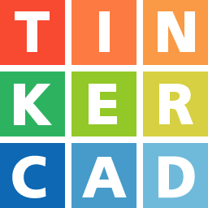

# Trabajo Practico N°2
Sistema de Procesamiento de Datos (SPD)
Ejercicio Estacion de subte


## Proyecto:Estacion de subte.


##Consigna SUBTE:
La empresa  “UTN FRA Robotics” ganó la licitación de un proyecto, y deberá Implementar un sistema que permita al usuario saber a qué estación de subte está llegando, aparte  el sistema muestra las estaciones que faltan hasta llegar a destino, para ello debemos utilizar 4 LEDs y el display de 7 segmentos. Esta vez el buzzer deberá emitir un sonido diferente cada vez que se llegue a una estación.
El sistema deberá arrancar apagado, luego de presionar el botón empezará y hará lo pedido.


## Función principal

``` C++
void prender_led(int led, int hz)
{
  int duracion = 200; // Duración en milisegundos del tono y el LED encendido
  int espera = 2000; // Tiempo de espera después de apagar el LED
  digitalWrite(led, HIGH);
  tone(buzzer, hz, duracion);
  delay(duracion);
  digitalWrite(led, LOW);
  delay(espera);
}

void loop()
{
  int p = digitalRead(pulsador);
if (p == 0 || flag) {
  flag = true;
  int leds[] = {led_rojo, led_naranja, led_azul, led_verde};
  int numeros[] = {3, 2, 1, 0};
  for (int i = 0; i < 4; i++) {
    display_off();
    display(numeros[i]);
    prender_led(leds[i], 500);
  }
}
}
```

### Explicacion

Enciende y apaga el buzzer junto al led correspondiente durante el tiempo indicado.

Recibe como parametros:
##void prender_led
+ **luz** (el led/pin), de tipo entenro, que va a encender junto a la buzzer.
+ **hz** es el segundo parametro que recibe la funcion **tone** dentro de `SonarBuzzer` que es la frecuencia del tono en Hz.
+ **int leds[]** = {led_rojo, led_naranja, led_azul, led_verde}; son los leds a prender
+ **int numeros[]** = {3, 2, 1, 0}; los casos del display 7 segmentos que tiene que prender
+ **int p = digitalRead(pulsador)** el pulsador que al apretarlo baja la bandera y empieza el bulce

---
##  Link al proyecto

- [Proyecto](https://www.tinkercad.com/things/fp6nTkKsQXA-dojo-2/editel?sharecode=2VxUAfkfkBHwUsTeON-zXtFQiMfw1mDRbSMpUzLJ7fI)

### Trabajo Practico:

[Consignas](https://github.com/magikboy/Dojo-N-mero-Uno/blob/18c1342eff3a6e0bedfadace646459866021de35/Dojo%20Numero%20Uno.pdf)

### Fuentes

- [Chat-GPT](https://chat.openai.com/)
- Youtube
- [Vladimir Guajardo Gonzalez](https://www.youtube.com/@SethPonder5/videos)
